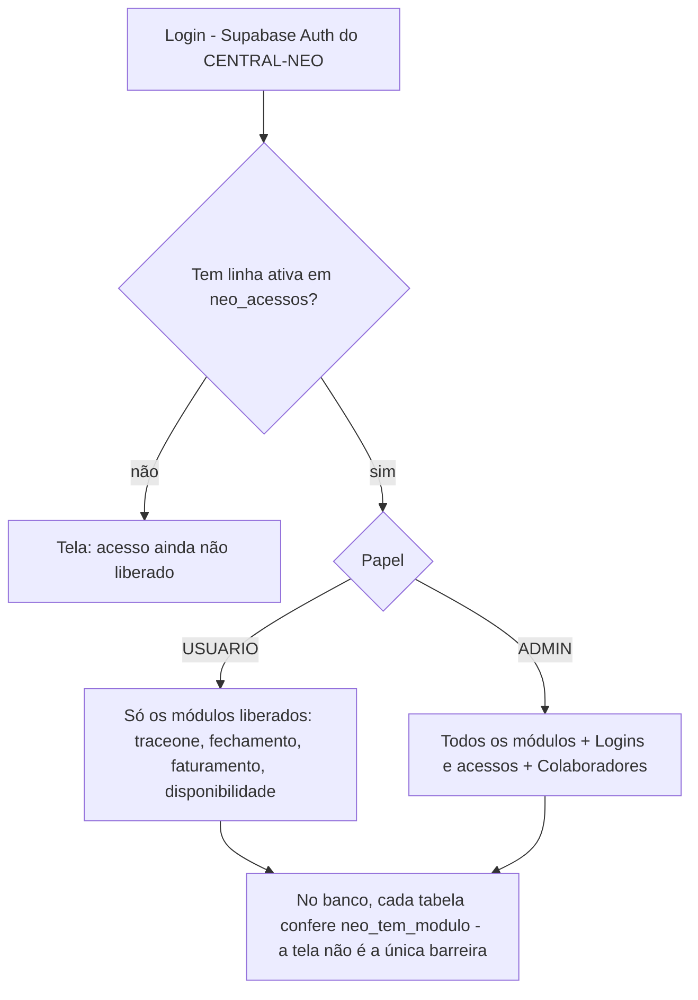

# Diagrama — Acesso por módulo

Fonte: `src/App.tsx`, `src/lib/neo.ts`, `CONTEXTO_GERAL.md` §3. Status: CONFIRMADO.

```mermaid
flowchart TD
  L[Login - Supabase Auth do CENTRAL-NEO] --> Q{Tem linha ativa em neo_acessos?}
  Q -- não --> SA[Tela: acesso ainda não liberado]
  Q -- sim --> M{Papel}
  M -- ADMIN --> TUDO[Todos os módulos + Logins e acessos + Colaboradores]
  M -- USUARIO --> MOD[Só os módulos liberados: traceone, fechamento, faturamento, disponibilidade]
  MOD --> RLS[No banco, cada tabela confere neo_tem_modulo - a tela não é a única barreira]
  TUDO --> RLS
```
